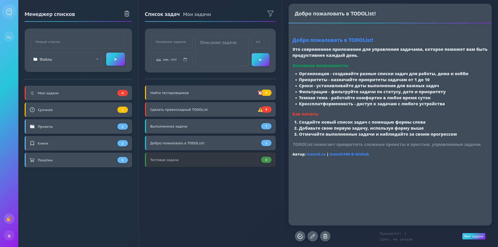

# Руководство пользователя TODOList
## Содержание
1. [Введение](#введение)
2. [Регистрация и авторизация](#регистрация-и-авторизация)
3. [Интерфейс приложения](#интерфейс-приложения)
4. [Управление списками задач](#управление-списками-задач)
5. [Управление задачами](#управление-задачами)
6. [Просмотр и редактирование задач](#просмотр-и-редактирование-задач)
7. [Фильтрация задач](#фильтрация-задач)
8. [Настройки](#настройки)
9. [Горячие клавиши](#горячие-клавиши)

## Введение
`TODOList` — это эффективный менеджер задач для организации личных и рабочих дел. Приложение позволяет создавать различные списки задач, устанавливать приоритеты, сроки выполнения и отслеживать статус каждой задачи. Интерфейс приложения адаптивен и подходит как для настольных компьютеров, так и для мобильных устройств.

Демонстрационную версию сервиса вы можете найти [здесь](https://todo.ivanvit.ru). 

## Регистрация и авторизация
### Регистрация нового аккаунта
1. При первом посещении приложения вы увидите окно авторизации
2. Нажмите на ссылку «Нет аккаунта? Зарегистрироваться»
3. Заполните поля:
    - Логин (минимум 3 символа)
    - Пароль (минимум 6 символов)
    - Подтверждение пароля
4. Нажмите кнопку «Зарегистрироваться»
5. После успешной регистрации вы будете автоматически авторизованы в системе

### Авторизация
1. На странице авторизации введите свой логин и пароль
2. Нажмите кнопку «Войти»
3. После успешной авторизации вы получите доступ к своим спискам задач

### Выход из аккаунта
- Нажмите кнопку 🔐 в левом нижнем углу экрана

## Интерфейс приложения
Интерфейс TODOList состоит из трёх основных секций:
1. **Менеджер списков** — здесь отображаются все ваши списки задач
2. **Список задач** — показывает задачи выбранного списка
3. **Просмотр задачи** — детальная информация о выбранной задаче

### Переключение между секциями
- **На компьютере**: все три секции отображаются одновременно
- **На мобильных устройствах**: используйте кнопки навигации ➤ в боковом меню

### Изменение темы
- Нажмите кнопку ⇋ в верхнем меню для переключения между светлой и тёмной темой
- Вы также можете изменить предпочтительную тему в меню [настроек](#настройки)

## Управление списками задач
### Создание нового списка задач
1. В секции «Менеджер списков» заполните поле «Новый список»
2. Выберите иконку для списка из выпадающего меню (опционально)
3. Нажмите кнопку ➤ для создания списка

### Выбор списка задач
- Кликните по названию списка в секции «Менеджер списков»
- Выбранный список будет отображен в секции «Список задач»

### Удаление списка задач
1. Выберите список задач
2. Нажмите кнопку с иконкой корзины рядом с заголовком «Менеджер списков»

## Управление задачами
### Создание новой задачи
1. В секции «Список задач» заполните поля:
    - Название задачи (обязательное поле)
    - Описание задачи (опционально)
    - Приоритет (lvl) — положительное число (опционально)
    - Срок выполнения — выберите дату (опционально)
2. Нажмите кнопку ➤ для создания задачи

### Просмотр задач
- Все задачи выбранного списка отображаются в секции «Список задач»
- Задачи с приближающимся сроком выполнения выделяются желтым цветом
- Просроченные задачи выделяются красным цветом
- Выполненные задачи отмечаются зеленым цветом

### Выбор задачи
- Кликните по названию задачи в списке для просмотра детальной информации

## Просмотр и редактирование задач
### Просмотр деталей задачи
После выбора задачи в секции «Просмотр задачи» отображается:
- Название задачи
- Описание
- Приоритет
- Срок выполнения
- Кнопки управления задачей

### Отметка о выполнении задачи
- Нажмите кнопку с галочкой в нижней части информации о задаче
- Статус задачи изменится на «Выполнено» или «Не выполнено»

### Редактирование задачи
1. Выберите задачу для просмотра
2. Нажмите кнопку с иконкой карандаша
3. Отредактируйте информацию:
    - Название
    - Описание
    - Приоритет
    - Срок выполнения
4. Нажмите кнопку с иконкой карандаша ещё раз для сохранения изменений

### Удаление задачи
1. Выберите задачу для просмотра
2. Нажмите кнопку с иконкой корзины
3. Задача будет удалена из списка

## Фильтрация задач
### Применение фильтров
1. В секции «Список задач» нажмите кнопку с иконкой фильтра
2. В появившемся окне выберите необходимые параметры фильтрации:
    - Только выполненные задачи
    - Только невыполненные задачи
    - Только задачи с указанной датой
    - Только задачи без даты
    - Минимальный приоритет
3. Нажмите кнопку «Применить»

### Сброс фильтров
1. Откройте окно фильтрации
2. Нажмите кнопку «Сбросить все»

## Настройки
Для доступа к настройкам нажмите на кнопку меню ☰ в левом нижнем углу экрана.

### Основные настройки
- **Тема оформления**: выбор между светлой и темной темой для стандартной загрузки
- **Цветовые оповещения по дате**: включение/отключение цветового выделения задач в зависимости от срока
- **Порядок сортировки**: выбор способа сортировки списков задач (по алфавиту, по дате, по приоритету, по количеству)

### Сохранение настроек
- После внесения изменений нажмите кнопку «Сохранить»
- Настройки будут применены немедленно и сохранены для будущих сессий

## Горячие клавиши
Для удобства работы с приложением можно использовать следующие комбинации клавиш:

- **Escape**: закрыть модальное окно/очистить фокус
- **Tab**: навигация между элементами интерфейса
- **Стрелки влево и вправо**: переключние фокуса между основными рабочими областями
- **Стрелки вверх и вниз**: переключение фокуса между элементами списков или кнопками действий
- **Ctrl + N**: создать новую задачу (может перебиваться браузерными биндингами)
- **Ctrl + L**: создать новый список задач
- **Ctrl + E**: выйти из аккаунта
- **Enter**: активировать выбранный элемент
- **Space**: активировать выбранный элемент